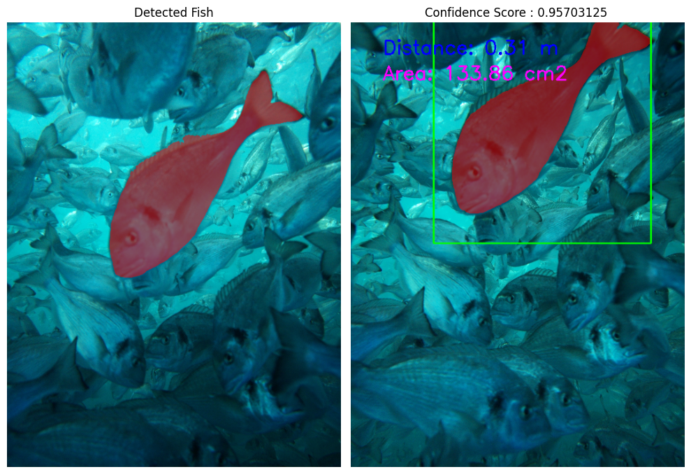

# Fishai

**Fishai** is a computer vision pipeline designed for **distance and mass estimation of fish in aquaculture** using a **stereo camera system**.  
The project combines deep learning models and classical stereo vision techniques to estimate fish size and weight in a **non-invasive, automated, and scalable** manner.

The repository includes tools for stereo camera calibration, model training (YOLO-based), disparity computation, and downstream mass estimation.

---

## Project Overview

Accurate biomass estimation is a critical challenge in aquaculture.  
This project addresses the problem by leveraging **stereo imagery** to estimate fish distance, surface area, and ultimately mass, without handling or stressing the animals.

The system processes synchronized stereo images and applies a multi-stage vision pipeline to ensure geometric consistency and reliable depth estimation.

---

## System Architecture

The pipeline is structured into three main components:

### 1. Keypoint Estimation & Pose Validation

A keypoint-based model is used to:

- Detect the fish and extract:
  - A bounding box
  - **Four anatomical keypoints**
- Validate that the fish is approximately **parallel to the camera plane**
- Filter out samples with unfavorable orientation that would degrade depth estimation accuracy

This step ensures geometric assumptions required for reliable stereo matching.

---

### 2. Segmentation & Stereo Disparity Estimation

A segmentation model is applied to isolate the fish silhouette.  
Using the stereo camera setup:

- The detected bounding box and segmentation mask are mapped between the left and right images
- Correspondences are established to compute a **disparity map**
- The disparity is converted into **metric distance** using stereo calibration parameters

This stage provides accurate depth estimation for each detected fish.

---

### 3. Mass Estimation

Using the estimated distance and segmentation mask:

- The **projected surface area** of the fish is calculated
- The surface measurement is converted into a **mass estimate** using empirical or biologically informed scaling models

This allows for automated biomass estimation at the individual fish level.

---

## Features

- **Stereo Camera Calibration**  
  Tools for intrinsic and extrinsic calibration of stereo camera systems, enabling accurate depth reconstruction.

- **Deep Learning Models**  
  - Keypoint estimation for pose validation  
  - Segmentation for precise fish outline extraction  
  - YOLO-based configurations for object detection and training

- **Distance & Mass Estimation**  
  End-to-end scripts for disparity computation, distance estimation, and fish mass inference.

- **Configuration-Driven Training**  
  Example configuration files such as:
  - `YOLO_train.yaml`
  - `hyp.yaml`

- **Reusable Utilities**  
  General-purpose Python utilities supporting data processing and computer visio

## Requirements

- **Python 3.x**  
- Recommended: OpenCV, NumPy, and other standard scientific libraries (install as needed for your workflow)

---

## Images

Here are the images stored in the `./images/` folder:

