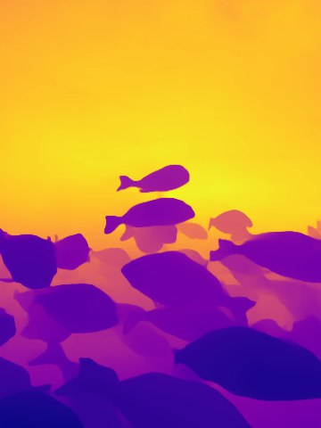

# fishai

**fishai** is a Python-based project aimed at providing tools for stereo camera calibration and related computer vision utilities. This repository contains scripts and configuration files for training object detection models (YOLO), stereo camera calibration, and various supporting utilities.

---

## Features

- **Stereo Camera Calibration:**  
  Functions for calibrating stereo vision systems, enabling accurate depth perception and 3D reconstruction.

- **YOLO Training Configuration:**  
  Example configuration files (`YOLO_train.yaml`, `hyp.yaml`) to facilitate training object detection models.

- **Utility Functions:**  
  General-purpose Python utilities to support computer vision workflows.

---

## Repository Structure

| File/Folder                       | Description                                      |
|---------------------------------- |--------------------------------------------------|
| `stereo_calibration_functions.py` | Python functions for stereo camera calibration   |
| `utilities.py`                    | Supporting utility functions                     |
| `YOLO_train.yaml`                 | Sample YOLO training configuration               |
| `hyp.yaml`                        | Sample YOLO hyperparameter configuration         |

---

## Requirements

- **Python 3.x**  
- Recommended: OpenCV, NumPy, and other standard scientific libraries (install as needed for your workflow)

---

## Images

Here are the images stored in the `./images/` folder:

